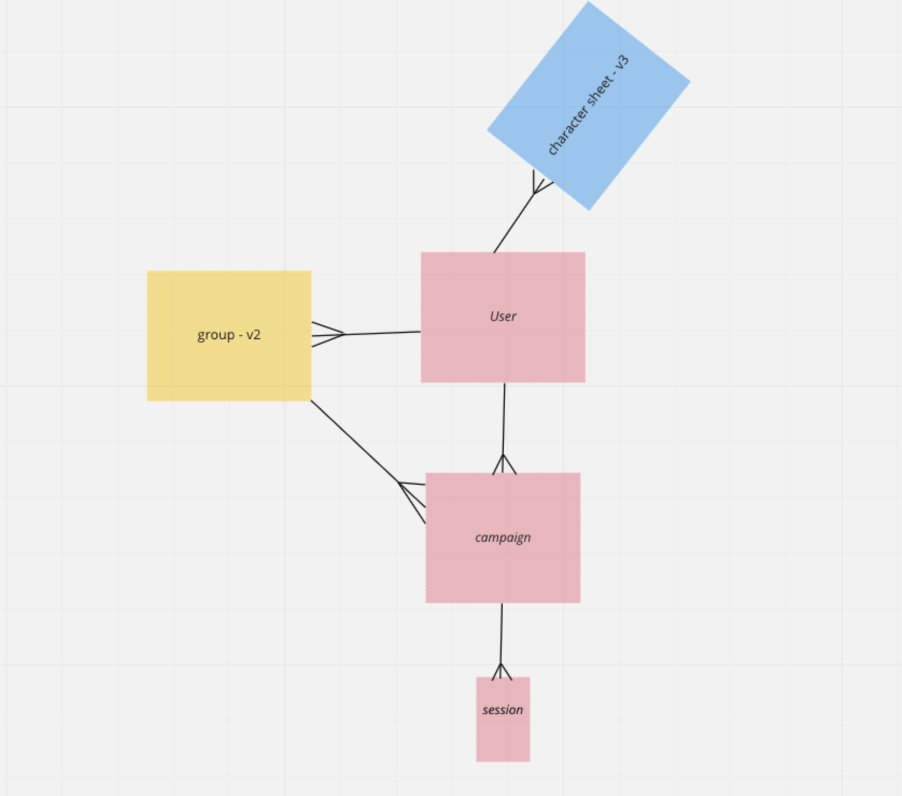
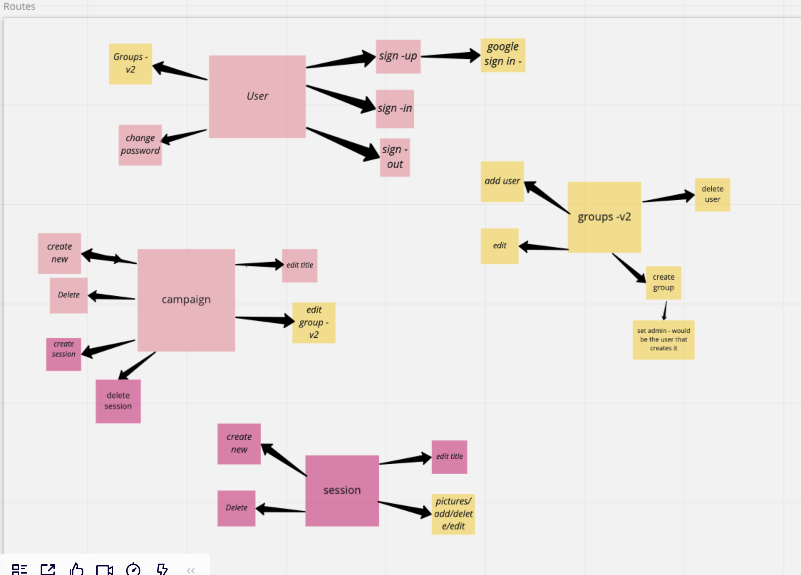
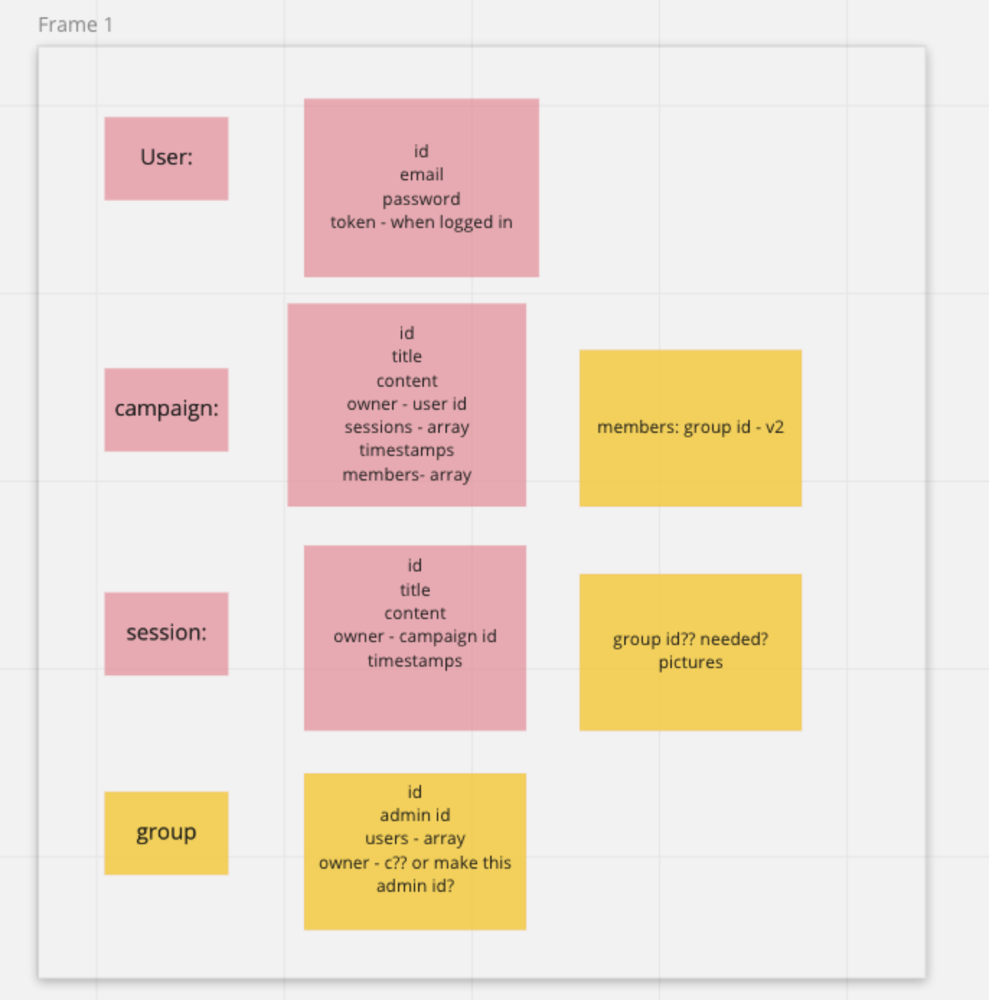

## Roll4Iinitiative API

Welcome! This is the API for the Roll4Iinitiative application.

Users can create an account and add new campaigns and entries for your campaigns to track their progress.

## Roll4 Api
### Users

<table>
<tr>
  <th colspan="4">Request</th>
  <th colspan="2">Response</th>
</tr>
<tr>
  <th>Verb</th>
  <th>URI</th>
  <th>body</th>
  <th>Headers</th>
  <th>Status</th>
  <th>body</th>
</tr>
<tr>
<td>POST</td>
<td>/sign-up</td>
<td>credentials</td>
<td>empty</td>
<td>201, Created</td>
<td>user</td>
</tr>
<tr>
<td>POST</td>
<td>/sign-in</td>
<td>credentials</td>
<td>empty</td>
<td>200 OK</td>
<td>user w/token</td>
</tr>
<tr>
<td>DELETE</td>
<td>/sign-out</td>
<td>empty</td>
<td>token</td>
<td>201 Created</td>
<td>empty</td>
</tr>
<tr>
<td>PATCH</td>
<td>/change-password</td>
<td>passwords</td>
<td>token</td>
<td>204 No Content</td>
<td>user w/token</td>
</tr>
<tr>
  <th colspan="6">Response Errors</th>
</tr>
<tr>
  <th colspan="4">Description</th>
  <th colspan="1">Status</th>
  <th colspan="1">Body</th>
</tr>
<tr>
  <td colspan="4">Invalid incoming request data</td>
  <td>400 Bad Request</td>
  <td>Error object</td>
</tr>
<tr>
  <td colspan="4">Missing or invalid Authorization token</td>
  <td>401 Unauthorized</td>
  <td>Unauthorized message</td>
</tr>
</table>

### Campaigns
<table>
<tr>
  <th colspan="4">Request</th>
  <th colspan="2">Response</th>
</tr>
<tr>
  <th>Verb</th>
  <th>URI</th>
  <th>body</th>
  <th>Headers</th>
  <th>Status</th>
  <th>body</th>
</tr>
<tr>
<td>POST</td>
<td> /campaigns</td>
<td>{}</td>
<td>token</td>
<td>201, Created</td>
<td>campaign Obj</td>
</tr>
<tr>
<td>GET</td>
<td>/campaigns</td>
<td>n/a</td>
<td>token</td>
<td>200, OK</td>
<td>campaigns Obj</td>
</tr>
<td>GET</td>
<td>/campaigns/:id</td>
<td>n/a</td>
<td>token</td>
<td>200, OK</td>
<td>campaign Obj</td>
</tr>
<tr>
<td>DELETE</td>
<td>/campaigns/:id</td>
<td> n/a </td>
<td>token</td>
<td>200, Ok</td>
<td>n/a</td>
</tr>
</tr>
<tr>
<td>PATCH</td>
<td>/campaigns/:id</td>
<td>campaign data</td>
<td>token</td>
<td>201, Ok</td>
<td>campaign Obj</td>
</tr>
<tr>
  <th colspan="6">Response Errors</th>
</tr>
<tr>
  <th colspan="4">Description</th>
  <th colspan="1">Status</th>
  <th colspan="1">Body</th>
</tr>
<tr>
  <td colspan="4">Invalid incoming request data</td>
  <td>400 Bad Request</td>
  <td>Error object</td>
</tr>
<tr>
  <td colspan="4">Missing or invalid Authorization token</td>
  <td>401 Unauthorized</td>
  <td>Unauthorized message</td>
</tr>
</table>

### Sessions
<table>
<tr>
  <th colspan="4">Request</th>
  <th colspan="2">Response</th>
</tr>
<tr>
  <th>Verb</th>
  <th>URI</th>
  <th>body</th>
  <th>Headers</th>
  <th>Status</th>
  <th>body</th>
</tr>
<tr>
<td>POST</td>
<td> /campaigns/:id/sessions</td>
<td>{}</td>
<td>token</td>
<td>201, Created</td>
<td>session Obj</td>
</tr>
<tr>
<td>GET</td>
<td>/campaigns/:id/sessions</td>
<td>n/a</td>
<td>token</td>
<td>200, OK</td>
<td>sessions Obj</td>
</tr>
<td>GET</td>
<td>/campaigns/:id/sessions/:id</td>
<td>n/a</td>
<td>token</td>
<td>200, OK</td>
<td>session Obj</td>
</tr>
<tr>
<td>DELETE</td>
<td>/campaigns/:id/sessions/:id</td>
<td>session data</td>
<td>token</td>
<td>204, Ok</td>
<td> n/a </td>
</tr>
</tr>
<tr>
<td>PATCH</td>
<td>/campaigns/:id/sessions/:id</td>
<td>session data</td>
<td>token</td>
<td>201, Ok</td>
<td>session Obj</td>
</tr>
<tr>
  <th colspan="6">Response Errors</th>
</tr>
<tr>
  <th colspan="4">Description</th>
  <th colspan="1">Status</th>
  <th colspan="1">Body</th>
</tr>
<tr>
  <td colspan="4">Invalid incoming request data</td>
  <td>400 Bad Request</td>
  <td>Error object</td>
</tr>
<tr>
  <td colspan="4">Missing or invalid Authorization token</td>
  <td>401 Unauthorized</td>
  <td>Unauthorized message</td>
</tr>
</table>

### ERD

